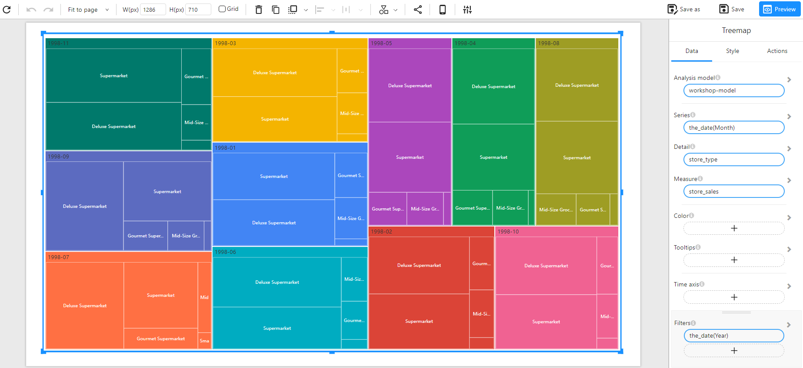

# Treemap Chart

## Overview

A **Treemap Chart** is used to visualize hierarchical data as a set of nested rectangles. Each branch of the hierarchy is represented by a rectangle, and its size corresponds to a specific measure. This type of chart is useful for analyzing proportions and identifying dominant categories within a dataset.

### When to Use

- To **visualize hierarchical data** in a compact and space-efficient way.
- To **compare proportions** between different categories and subcategories.
- To **identify patterns** such as the largest or smallest contributors within a dataset.

## Data Structure

A **Treemap Chart** requires:

- **Series**: A categorical field representing the top-level grouping (e.g., `the_date(Month)`).
- **Detail**: A categorical field defining subcategories within each group (e.g., `store_type`).
- **Measure**: A numerical field representing the value used to size the rectangles (e.g., `store_sales`).
- **Color (Optional)**: Used to set the color of the chart based on categories or numerical values (e.g., `store_sales` for intensity-based coloring, or a categorical field for distinct colors).
- **Tooltips (Optional)**: Additional information to be displayed when hovering over the sections.
- **Time Axis (Optional)**: Allows for time-based filtering.
- **Filters (Optional)**: Used to refine the displayed data (e.g., filtering by year or region).

## Example

###  Data Structure

| the_date (Month) | store_type          | store_sales |
| ---------------- | ------------------- | ----------- |
| 1998-11          | Supermarket         | 73920.69    |
| 1998-11          | Deluxe Supermarket  | 62067.19    |
| 1998-11          | Gourmet Supermarket | 14364.67    |
| 1998-11          | Mid-Size Grocery    | 10940.17    |
| 1998-11          | Small Grocery       | 5458.03     |
| 1998-09          | Supermarket         | 78567.44    |
| 1998-09          | Deluxe Supermarket  | 65789.32    |
| 1998-09          | Gourmet Supermarket | 16789.53    |

###  Treemap Chart

