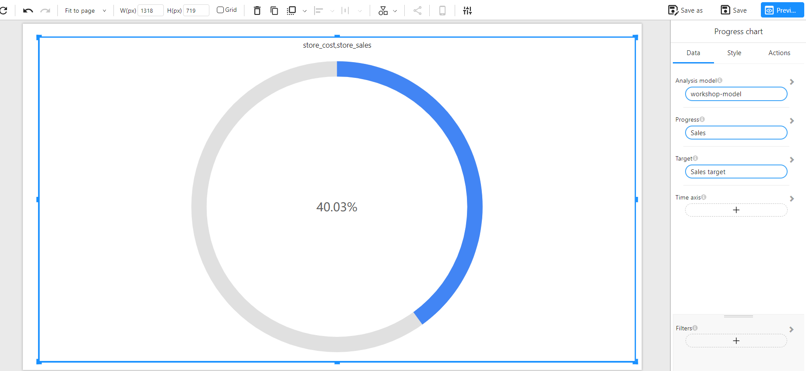

# Progress Chart

## Overview

A **Progress Chart** visually represents the completion rate of a given metric relative to a target. It displays a circular indicator showing the percentage of progress made, allowing users to quickly evaluate performance against a goal.

This chart is especially useful in dashboards for showcasing key performance indicators (KPIs), such as sales achievement, task completion, or budget usage.

### When to Use

- To track **progress toward a target** (e.g., sales vs. sales target).
- To highlight **KPI performance** with a quick, intuitive visual.
- To display **goal achievement** in a compact and visually appealing way.

## Data Structure

A **Progress Chart** requires the following fields:

- **Analysis model**: A data model containing the metric and target fields.
- **Progress**: The actual value to be evaluated (e.g., Sales).
- **Target**: The expected or target value (e.g., Sales target).
- **Time axis (Optional)**: A time-based dimension (e.g., date or month), which can be used to evaluate progress over a specific time range.

### Example Data Structure

| date       | store_sales | sales_target |
| ---------- | ----------- | ------------ |
| 2024-01-01 | 12000       | 30000        |
| 2024-01-02 | 15000       | 30000        |

## Example

The following example visualizes sales performance. The actual sales have reached 40.03% of the target:

