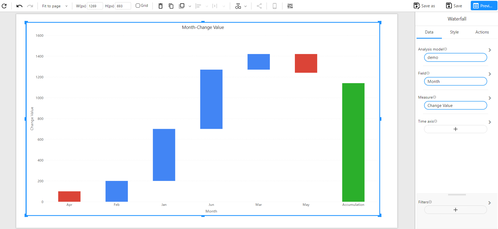

# Waterfall Chart

## Overview

A **Waterfall Chart** is used to visualize how an initial value is affected by a series of intermediate positive or negative changes. It helps in understanding the cumulative effect of sequential changes in a value over time or across categories.

This chart is particularly useful in financial analysis, operational performance, and variance analysis to explain how a value evolves step-by-step.

### When to Use

- To analyze **incremental changes** contributing to a total.
- To display **positive and negative contributions** to a metric.
- To explain **variance** between starting and ending values.
- To visualize **cumulative growth** over time or across groups.

## Data Structure

A **Waterfall Chart** requires the following fields:

- **Analysis model**: The data source containing relevant fields.
- **Field**: A categorical or time-based dimension (e.g., Month, Department).
- **Measure**: A numeric field representing the change values (e.g., Profit delta, Monthly growth).
- **Time axis (Optional)**: A time-based field to sort the data chronologically.
- **Filters (Optional)**: Used to narrow down the scope of data shown in the chart.

### Example Data

| month | change_value |
| ----- | ------------ |
| Jan   | 500          |
| Feb   | 200          |
| Mar   | -300         |
| Apr   | 100          |
| May   | -200         |

## Example

The example below shows monthly changes and the resulting total. Each bar represents the increase or decrease in value, with the final green bar showing the cumulative result:

