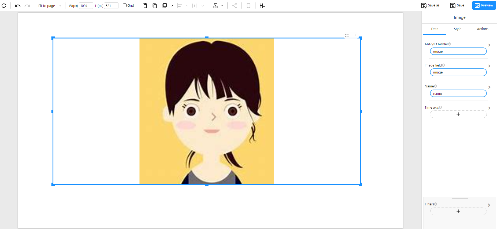

# Image

## Overview

The **Image** component is used to display pictures dynamically within dashboards or reports. It supports both static image URLs and dynamically generated images using Base64 encoding or URL fields from the data model. This component is useful for personalized visualizations, profile photos, product images, QR codes, or any data-driven imagery.

### When to Use

- To display **profile images**, **product visuals**, or **icons** dynamically based on data.
- To embed **Base64-encoded images** or **image URLs** stored in the dataset.

## Data Structure

The **Image** component requires the following fields:

- **Analysis model**: The dataset containing the image information.
- **Image field**: A field that contains either:
  - A URL string pointing to the image location, or
  - A Base64-encoded image string (e.g., `data:image/png;base64,...`).
- **Name (Optional)**: A field used to label or identify the image.
- **Time axis (Optional)**: If image changes are related to time, this can be used to display the latest or trend-related images.
- **Filters (Optional)**: Restrict which images are shown based on selected conditions.

### Notes:

- If using a **Base64-encoded field**, ensure the string is properly prefixed with the MIME type (e.g., `data:image/png;base64,`).
- The **Image field** must be mapped to a valid URL or Base64 string for the component to render properly.
- Images will automatically scale to fit the component's size unless style settings are adjusted.

### Example Data Structure

| name  | image                                               |
| ----- | --------------------------------------------------- |
| Alice | `https://example.com/images/alice.jpg`              |
| Bob   | `data:image/png;base64,iVBORw0KGgoAAAANSUhEUgAA...` |

## Example

The example below shows an image rendered from a Base64 or URL field in the dataset. This image can change based on filters, user profiles, or dynamic records:

