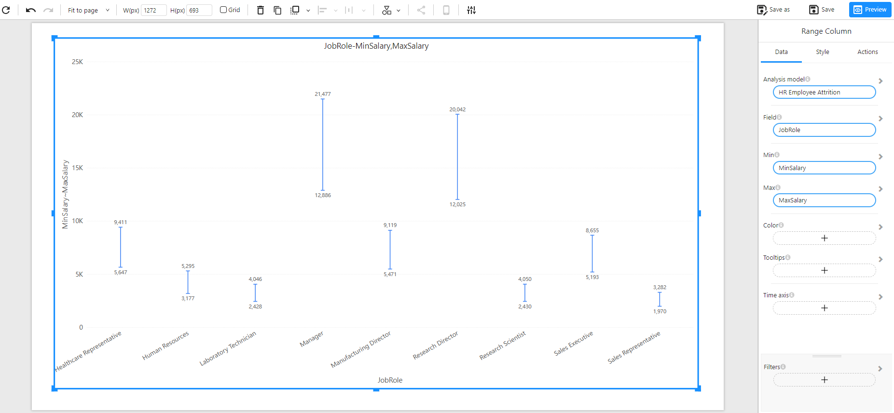

# Range Column Chart

## Overview

A **Range Column Chart** displays a range between two numeric values (such as minimum and maximum) across categories. It is ideal for visualizing value spreads, distributions, or uncertainty intervals, such as salary ranges, temperature ranges, or performance bounds.

This chart helps compare the extent of variation within categories and identify outliers or wide/narrow ranges.

### When to Use

- To visualize **minimum and maximum values** within categories.
- To analyze **value spreads** such as salary ranges, stock price ranges, or experimental bounds.
- To compare **variation or dispersion** across different groups.
- To highlight **range-based patterns** or outliers.

## Data Structure

A **Range Column Chart** requires the following fields:

- **Analysis model**: The dataset used to drive the chart.
- **Field**: A categorical dimension (e.g., Job Role, Region).
- **Min**: A numeric field representing the lower bound of the range (e.g., MinSalary).
- **Max**: A numeric field representing the upper bound of the range (e.g., MaxSalary).
- **Color (Optional)**: Used to differentiate ranges by category or condition.
- **Tooltips (Optional)**: Show additional information on hover.
- **Time axis (Optional)**: Useful if analyzing time-based grouped ranges.
- **Filters (Optional)**: Used to narrow down the displayed data.

### Example Data

| JobRole               | MinSalary | MaxSalary |
| --------------------- | --------- | --------- |
| Sales Executive       | 5,193     | 8,655     |
| Manager               | 12,886    | 21,477    |
| Research Scientist    | 2,430     | 4,050     |
| Laboratory Technician | 2,428     | 4,046     |

## Example

The following example shows the minimum and maximum salaries across different job roles. The vertical line for each role indicates the salary range from minimum to maximum:

