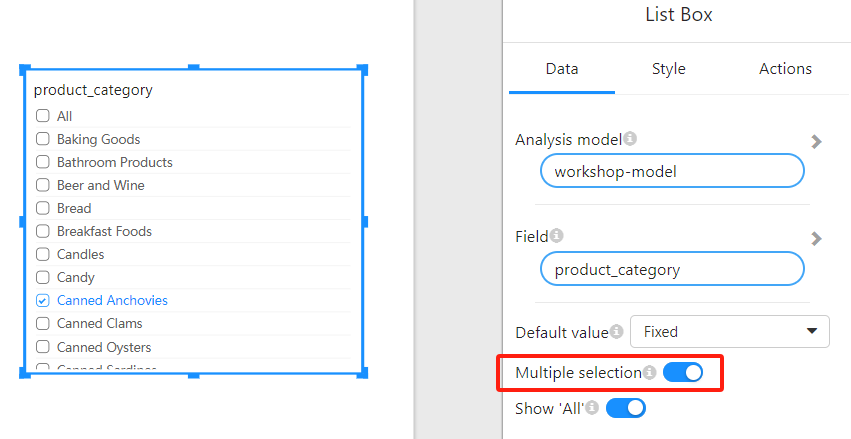
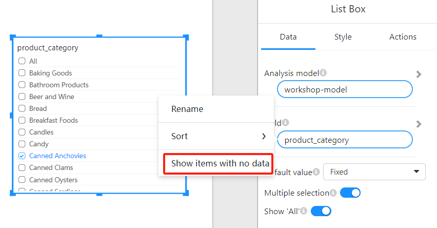

# List Box

## 1. Overview

The **List Box** filter allows users to select one or more options from a list to filter data in the report.

## 2. List Box Configuration Options

When configuring the List Box filter, you can adjust the following options to enhance the flexibility of the filter.

### 2.1 Multiple Selection Switch

- The **Multiple Selection** switch allows users to select multiple options.
  
- By default, users can select only one option. When this option is enabled, users can select multiple values from the List Box.

  

### 2.2 Show 'All' Switch

- The **Show 'All'** switch allows a "Select All" option to be displayed in the filter.

- When this option is enabled, the List Box will show an "All" option, allowing users to select all data at once.

  

### 2.3 Default Value Setting

The **Default Value** option sets the default selection for the List Box filter. You can choose **Fixed** or **Relative**.

- **Fixed**: Allows you to select a fixed default value. You can manually choose a field value as the default selection.
  - **Note**: When **Row-level Security** is enabled, some users may not have permission to view the fixed value. If the user does not have permission to view the default value, the List Box will appear empty or will not respond to that default selection.
  
- **Relative**: A relative selection, where you can choose one of the following default settings:
  - **First Item**: The first item in the list is selected by default.
  - **Last Item**: The last item in the list is selected by default.

### 2.4 Sorting Options

You can configure the sorting of options in the List Box:

- **No Sorting**: No sorting is applied to the items.
- **Ascending**: Options are sorted in ascending order.
- **Descending**: Options are sorted in descending order.

### 2.5 Show Items with No Data

- **Show items with no data**: When this option is enabled, the List Box will show items even if they have no data. In some business scenarios, you may want users to see all possible options, not just those with data.

  

