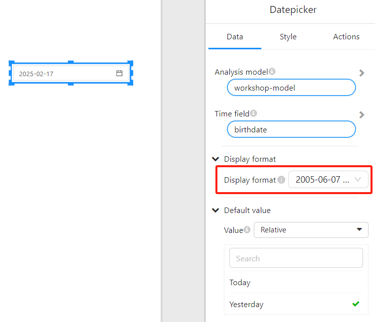
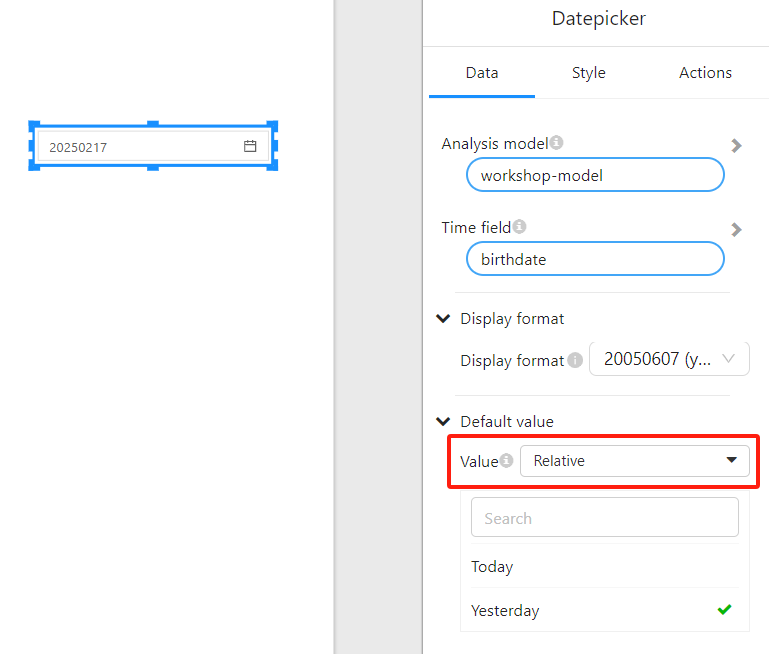
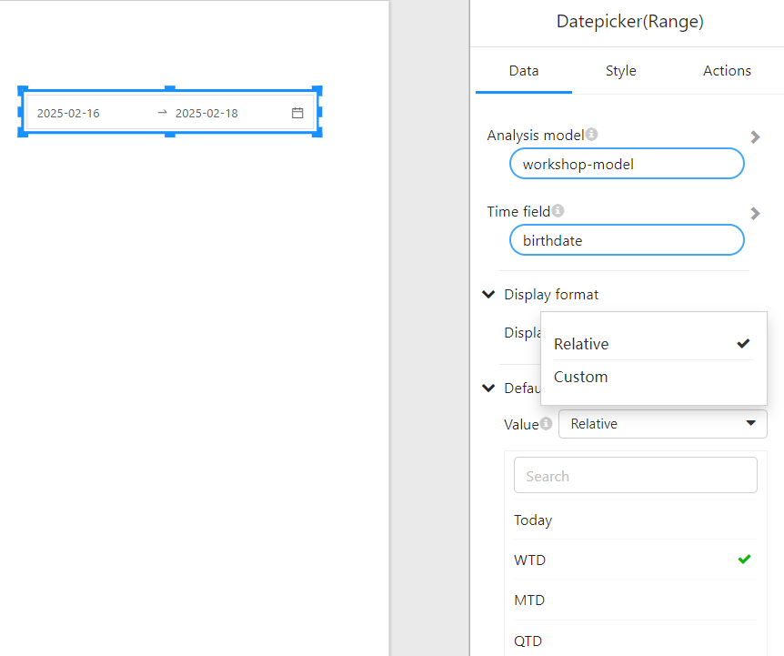

# Datepicker and Datepicker Range

## 1. Overview

**Datepicker** and **Datepicker Range** allow users to select a single date or a date range to filter report data.

- **Datepicker** is used when users need to select a **single date**, such as filtering sales data for a specific day.
- **Datepicker Range** is used when users need to select a **date range**, such as filtering data for a specific time period.

---

## 2. Datepicker (Single Date)

### 2.1 Configuring the Datepicker Filter

#### **2.1.1 Date Format**

- The **Display format** option allows you to set the date format, such as `YYYY-MM-DD` or `DD/MM/YYYY`.

  

#### **2.1.2 Default Value**

The **Default Value** option sets the default selection for the Datepicker filter. You can choose either **Fixed** or **Relative**:

- **Fixed**: Manually select a specific default date.

- **Relative**: Users can choose from options such as:

  - **Today**
  - **Yesterday**

---

## 3. Datepicker Range (Date Range)

### 3.1 Configuring the Datepicker Range Filter

#### **3.1.1 Date Format**

- Similar to the single date filter, you can set the date display format in the **Display format** option.

  

#### **3.1.2 Default Value**

The **Default Value** option sets the default date range for the Datepicker Range filter. You can choose either **Fixed** or **Relative**:

- **Fixed**: Manually select the default start and end dates.

- **Relative**: Users can choose from options such as:

  - **Today**
  - **WTD** (Week to Date)
  - **MTD** (Month to Date)
  - **QTD** (Quarter to Date)

  

