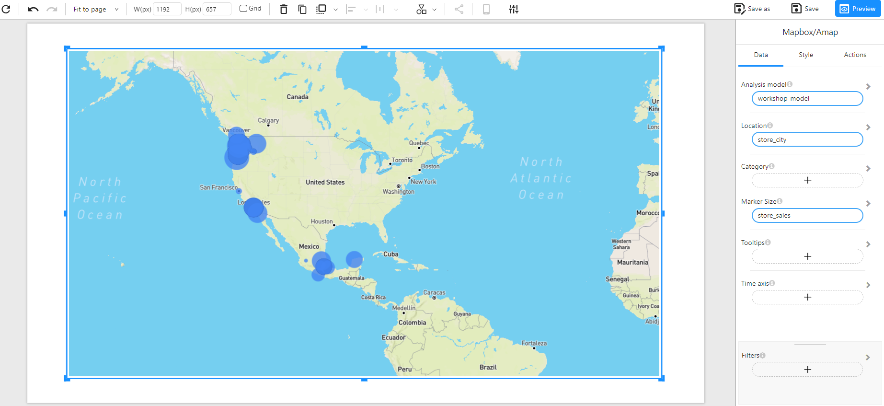

# Marker Map

## Overview

Before using the map, you must obtain an API Key and configure the map settings. For details, refer to [GIS Map Settings](/documentation/Visualization/GIS-Map-Settings/).

The **Marker Map** is used to plot data points on **Mapbox** or **AMap (Gaode Map)**. Users can set a uniform marker shape in the style settings, such as **circle, triangle, square, square column**. All points will use the same marker shape., and distinguish different categories using color or size.

### When to Use

- **Visualizing geographic data** by displaying location information with markers.
- **Analyzing spatial distribution patterns**, such as store sales across different cities, population density, or business coverage.
- **Comparing different data categories** using distinct marker shapes or colors.

## Data Structure

The **Marker Map** requires the following data (**Longitude & Latitude or Location is required**):

- **Longitude & Latitude / Location**: Longitude and latitude are numerical values representing the position of data points. Location can be a geographical name (e.g., city, address).
- **Category (Optional)**: Used to differentiate data points, displayed using color encoding.
- **Marker Size (Optional)**: A numerical field to define marker size (e.g., `store_sales`).
- **Tooltips (Optional)**: Displays additional details when hovering over a marker.
- **Filters (Optional)**: Used to filter displayed data (e.g., by country or sales range).

## Location Parsing

If the dataset contains a **Location** field but does not include longitude and latitude, the system will use **Mapbox** or **AMap**'s **geolocation API** to query the corresponding coordinates and cache them in the **OptimiBI** system. When loading the map later, the system retrieves the longitude and latitude from the cache to improve loading speed.

If the dataset already contains **Longitude & Latitude**, the map will directly use them for rendering markers without requiring location parsing.

## Configuration Guide

### Plot Data Points Using Longitude & Latitude or Location

**Example Data Structure**

| Location                                                     | Longitude | Latitude | store_sales |
| ------------------------------------------------------------ | --------- | -------- | ----------- |
| New York                                                     | -74.006   | 40.7128  | 100000      |
| Los Angeles                                                  | -118.2437 | 34.0522  | 85000       |
| Chicago                                                      | -87.6298  | 41.8781  | 72000       |
| Houston                                                      | -95.3698  | 29.7604  | 69000       |
| Miami                                                        | -80.1918  | 25.7617  | 50000       |
| **Example**: The following example visualizes **store sales using different marker shapes, with size based on sales values**. |           |          |             |

## Customization Options

- **Map Providers**: Supports **Mapbox** and **AMap (Gaode Map)** for rendering maps.
- **Base Map Styles**: Options include Normal, `dark`, `light`, etc.
- **Marker Shapes**: Supports `circle`, `triangle`, `square`, `square column`, and more.
- **Interactive Controls**: Supports zooming, panning, and tooltips.
