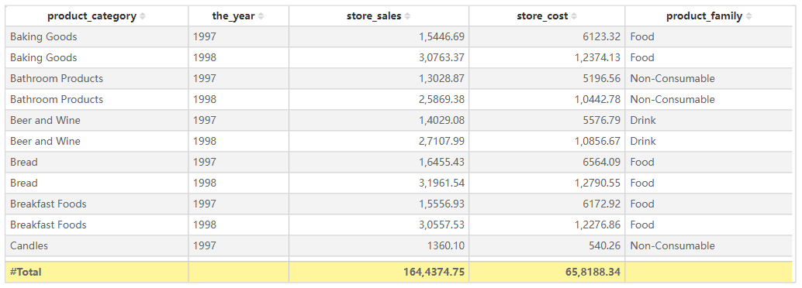

# Table

## Overview

The Table  component is designed to display structured data in a tabular format. Each row represents a data entry, and each column corresponds to a specific field. It is particularly useful for displaying detailed records, structured lists, and data comparisons.

## Key Features

- **Sorting**: Click on a column header to sort data in ascending or descending order.
- **Filtering**: Apply filters via the filter pane or interactive slicers.
- Formatting:
  - Adjust column width
  - Change background color
  - Modify text alignment
  - Configure borders and gridlines
- **Conditional Formatting**: Highlight key data points using color mapping, data bars, or icon sets.
- **Interactivity**: Supports interaction with other visual components, including cross-filtering and highlighting.

## Configuring the Table Component

### 1. **Field Configuration**

- Add the desired fields into the visualization.
- Adjust field order by dragging and repositioning them.

### 2. **Style Settings**

#### Title

- **Display**: Toggle visibility of the table title.
- **Content**: Enter the title text.
- **Alignment**: Set left, center, or right alignment.
- Font Settings:
  - **Font Family**: Select the font type.
  - **Font Size**: Customize the font size.
  - **Font Style**: Bold (B), Italic (I), Underline (U).
- **Background**: Set the title bar background color.

#### Effects

- **Background Color**: Customize the overall background color of the table.
- Borders:
  - **Border Width**: Adjust border thickness.
  - **Border Style**: Choose from solid, dashed, etc.
- **Rounded Corners**: Set the radius of the table corners.
- **Shadow**: Apply outer shadow effects to the table.

#### Grid

- **Grid Lines**: Toggle grid visibility and color.
- Alternating Row Colors:
  - **Odd Row Background**: Set background color for odd-numbered rows.
  - **Even Row Background**: Set background color for even-numbered rows.
- Hover Effects:
  - **Enable Hover**: Highlight rows on hover.
  - **Hover Background Color**: Define the background color when hovering over a row.
- **Row Height**: Specify row height in pixels.

#### Header

- **Header Alignment**: Set column header alignment (left, center, right).
- **Background Color**: Customize the header background color.
- Font Settings:
  - **Font Family, Size, and Style** (bold, italic, underline).
- **Word Wrap**: Enable text wrapping for long headers.

#### Content

- **Font Settings**: Configure font type, size, and style for data values.
- **Word Wrap**: Enable automatic text wrapping within cells.
- **Column Alignment**: Individually set column alignment.
- **Row Numbering**: Toggle row number visibility.
- **Frozen Columns**: Lock specific columns to remain visible when scrolling horizontally.

#### Grand Total

- **Show Grand Total**: Toggle the display of the total row.
- **Title**: Customize the total row’s title text.
- **Background Color**: Set the background color for the total row.
- **Font Settings**: Customize font style for total values.

#### Toolbar

- Display Mode:
  - **Always Visible**
  - **Show on Hover**
  - **Hidden**
- **Toolbar Color**: Customize toolbar color.
- **Extended Background**: Expand toolbar background settings.

## Table vs.  Pivot 

| Feature                | Table           | Pivot       |
| ---------------------- | --------------- | ----------- |
| Data Hierarchy         | ❌ Not Supported | ✅ Supported |
| Cross Aggregation | ❌ Not Supported | ✅ Supported |
| Subtotals | ❌ Not Supported | ✅ Supported |
| Grand Totals |  ✅ Supported | ✅ Supported |
| Conditional Formatting | ✅ Supported     | ✅ Supported |

## Use Cases

- Displaying detailed datasets, such as sales orders or user lists.
- Serving as a base for data exports, allowing CSV export of detailed records.
- Providing a simple and structured way to present tabular data.
- Enabling interactive filtering, data analysis, and data comparison in reports.