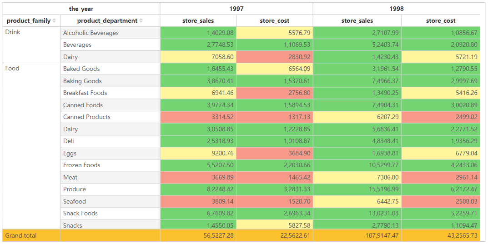

# Pivot Table

## Overview

The **Pivot Table** is designed to display multi-dimensional data in a structured, hierarchical format. It enables dynamic aggregation and analysis of data across multiple dimensions, making it a powerful tool for financial reports, sales analysis, and business intelligence applications.

## Key Features

- **Hierarchical Data Representation**: Supports row and column hierarchies for multi-level data analysis.
- **Dynamic Aggregation**: Summarizes data based on selected dimensions and measures.
- **Sorting**: Allows sorting data within each row and column level.
- **Filtering**: Users can apply filters via the filter pane or slicers to refine displayed data.
- **Conditional Formatting**: Enables the application of color mappings, data bars, and icon sets for better insights.
- **Grand Totals & Subtotals**: Provides automatic calculations at different hierarchical levels.
- **Expandable & Collapsible Groups**: Users can drill down or collapse levels for better navigation.
- **Interactivity**: Supports interaction with other visual components for cross-filtering and highlighting.

## Configuring the Pivot Table Component

### 1. **Field Configuration**

- **Rows**: Add fields to define row hierarchies.
- **Columns**: Add  fields to define column categories.
- **Measures**: Add numeric values to be aggregated in the pivot table.
- **Time Axis (Optional)**: Apply a time-based dimension for trend analysis.

### 2. **Style Settings**

#### Title

- **Display**: Toggle visibility of the title.
- **Content**: Enter the pivot table title.
- **Alignment**: Set left, center, or right alignment.
- Font Settings:
  - **Font Family**: Select the font type.
  - **Font Size**: Customize the font size.
  - **Font Style**: Bold (B), Italic (I), Underline (U).
- **Background**: Set the title background color.

#### Effects

- **Background Color**: Customize the overall background color of the pivot table.
- Borders:
  - **Border Width**: Adjust border thickness.
  - **Border Style**: Choose from solid, dashed, etc.
- **Rounded Corners**: Adjust table corner radius.
- **Shadow**: Apply outer shadow effects.

#### Grid

- **Grid Lines**: Toggle visibility of grid lines and customize colors.
- Alternating Row Colors:
  - **Odd Row Background**: Set background color for odd rows.
  - **Even Row Background**: Set background color for even rows.
- Hover Effects:
  - **Enable Hover**: Highlight rows when hovered.
  - **Hover Background Color**: Set hover effect color.
- **Row Height**: Customize row height in pixels.

#### Header

- **Header Alignment**: Set alignment of column headers.
- **Background Color**: Customize the header background.
- Font Settings:
  - **Font Family, Size, and Style** (bold, italic, underline).
- **Word Wrap**: Enable automatic text wrapping for headers.

#### Content

- **Font Settings**: Configure font type, size, and style for data values.
- **Word Wrap**: Enable automatic text wrapping within cells.
- **Column Alignment**: Individually set alignment for each column.
- **Row Numbering**: Toggle row number visibility.
- **Merge Cells**: Enable merging of identical values across rows.

#### Subtotals

- **Display Subtotals**: Choose whether to show or hide subtotal rows.
- **Position**: Configure subtotals at the top or bottom of groups.
- **Background Color**: Customize subtotal row backgrounds.

#### Grand Total

- **Show Grand Total**: Toggle the display of the total row.
- **Caption**: Customize the text displayed for the grand total row.
- **Background Color**: Set the background color for the grand total.
- **Font Settings**: Configure the font style for total values.

#### Toolbar

- Display Mode:
  - **Always Visible**
  - **Show on Hover**
  - **Hidden**
- **Toolbar Color**: Customize toolbar color.
- **Extended Background**: Expand toolbar background settings.

## Pivot Table vs. Standard Table

| Feature                  | Pivot Table                                         | Table        |
| ------------------------ | ------------------------------------------------------------ | --------------------- |
| Data Hierarchy           | ✅ Supported                                                  | ❌ Not Supported       |
| Subtotal | ✅ Supported                                                  | ❌ Not Supported       |
| Grand Totals | ✅ Supported                                                  | ✅ Supported       |
| Cross Aggregation        | ✅ Supported                                                  | ❌ Not Supported       |
| Conditional Formatting   | ✅ Supported                                                  | ✅ Supported           |

## Use Cases

- Displaying hierarchical data structures such as sales performance by region and year.
- Analyzing financial summaries with totals and subtotals.
- Creating interactive pivot reports that allow users to drill down into data.
- Comparing multiple categories and summarizing numerical values dynamically.
