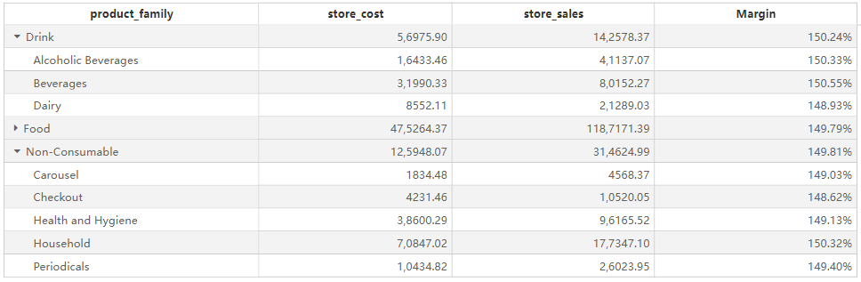

# Hierarchy Table

## Overview

The **Hierarchy Table** allows users to display hierarchical data structures with expandable and collapsible rows. It is useful for analyzing grouped data, enabling drill-down capabilities for better insights. This component is commonly used in financial reporting, sales analysis, and inventory management.

## Key Features

- **Hierarchical Data Representation**: Supports multiple levels of row hierarchy for structured data analysis.
- **Expandable & Collapsible Groups**: Users can expand or collapse hierarchy levels interactively.
- **Sorting**: Allows sorting within each hierarchy level.
- **Filtering**: Users can apply filters via the filter pane to refine displayed data.
- **Aggregations**: Automatically calculates subtotals and totals at each hierarchy level.
- **Interactivity**: Supports interaction with other visual components for cross-filtering.

## Configuring the Hierarchy Table Component

### 1. **Field Configuration**

- **Hierarchy Level Fields**: Define hierarchical groupings by add fields into this section (e.g., `product_family`, `product_department`).
- **Fields**: Add numeric or categorical fields that will be displayed as data columns.

### 2. **Style Settings**

#### Title

- **Display**: Toggle the visibility of the title.
- **Content**: Enter the hierarchy table title.
- **Alignment**: Set left, center, or right alignment.
- Font Settings:
  - **Font Family**: Select the font type.
  - **Font Size**: Customize the font size.
  - **Font Style**: Bold (B), Italic (I), Underline (U).
- **Background**: Set the title background color.

#### Effects

- **Background Color**: Customize the overall background color of the hierarchy table.
- Borders:
  - **Border Width**: Adjust border thickness.
  - **Border Style**: Choose from solid, dashed, etc.
- **Rounded Corners**: Adjust the corner radius.
- **Shadow**: Apply an outer shadow effect.

#### Grid

- **Grid Lines**: Toggle the visibility of grid lines and customize colors.
- Alternating Row Colors:
  - **Odd Row Background**: Set background color for odd rows.
  - **Even Row Background**: Set background color for even rows.
- Hover Effects:
  - **Enable Hover**: Highlight rows on hover.
  - **Hover Background Color**: Customize the hover effect color.
  - **Row Height**: Customize row height in pixels.

#### Header

- **Header Alignment**: Set alignment of column headers.
- **Background Color**: Customize the header background.
- Font Settings:
  - **Font Family, Size, and Style** (bold, italic, underline).
  - **Word Wrap**: Enable automatic text wrapping for headers.

#### Content

- **Font Settings**: Configure font type, size, and style for data values.
- **Word Wrap**: Enable automatic text wrapping within cells.
- **Column Alignment**: Set alignment for each column.
- **Expand/Collapse Icons**: Enable icons to toggle hierarchy levels.

#### Grand Total

- **Show Grand Total**: Toggle the display of the grand total row.
- **Caption**: Customize the text displayed for the grand total row.
- **Background Color**: Set the background color for the total row.
- **Font Settings**: Configure the font style for total values.

#### Toolbar

- Display Mode:

  - **Always Visible**
  - **Show on Hover**
  - **Hidden**
  
- **Toolbar Color**: Customize toolbar color.

- **Extended Background**: Expand toolbar background settings.

## Hierarchy Table vs. Standard Table

| Feature                | Hierarchy Table | Standard Table  |
| ---------------------- | --------------- | --------------- |
| Hierarchical Structure | ✅ Supported     | ❌ Not Supported |
| Expand/Collapse Rows   | ✅ Supported     | ❌ Not Supported |
| Aggregations at Levels | ✅ Supported     | ❌ Not Supported |
| Sorting & Filtering    | ✅ Supported     | ✅ Supported     |
| Custom Styling Options | ✅ Supported     | ✅ Supported     |

## Use Cases

- Displaying **product categories** with subcategories in sales reports.
- Creating **financial reports** with breakdowns by department and region.
- Analyzing **inventory data** with hierarchical structures.
- Generating **performance reports** with drill-down capabilities.
