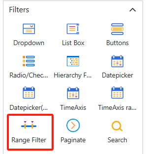
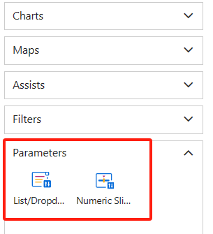

# v6.05 Release Notes

1. Tab component supports dynamic switching of tabs using parameters (User、Role、Custom parameters).

2. New **numerical range** filter component.

   <div align="left"></div>

   <div align="left"></div>

3. New Parameter Filter Components (**List/Dropdown, Numeric Slider**)

   <div align="left"></div>

   

4. Remove the configuration of associated fact table  from the filtering components. Multiple fact table analysis models can set a filter to associated fact table.

5. Optimize the geocoding in the map component.

6. Enhance the **progress ring** component.

7. Enhance the **Tab** component.

8. Enhance the component's toolbar.

9. Enhance the **Google/OpenStreetMap** component.

10. Enhance the effect of data points on maps and scatter plots.

11. More Fonts.

12. Optimize page performance and reduce page size.

11. Enhance **"Data preview"** functionality.

 

## Functionality

1. Added manage parameters functionality

   
   <div align="left"></div>

   <div align="left"></div>

2. Edit mode supports enabling and disabling grid lines on the canvas.

   <div align="left"></div>

3. Support for using parameters in calculated measure and component title content.

   - Referencing parameters in calculated measure: **ParamRef("parameter_name")**


   Example:

   ```
   [Measures].[previous year sales] * ParamRef("growth rate")
   ```

   

   - Referencing parameters in title : **${parameter_name"}**


4. Support for **Snowflake** and **Google BigQuery** data sources.

5. Fact table: Added a "**Fact count**" field.

6. Measure filtering performance optimization.

7. Constant field cross-query performance optimization.

8. Support for automatic generation of hierarchy for time fields in **SQL Server** and **Apache Doris**.

