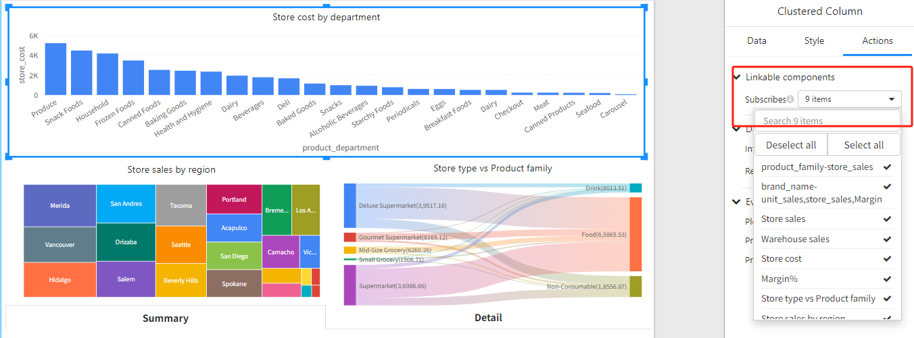
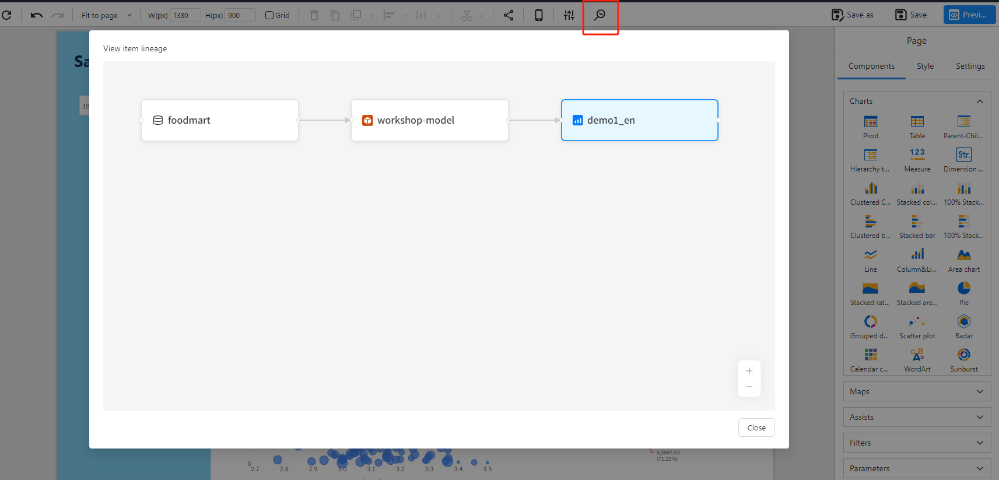
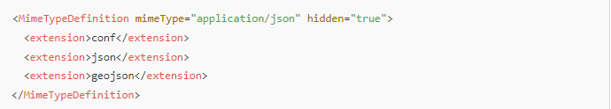
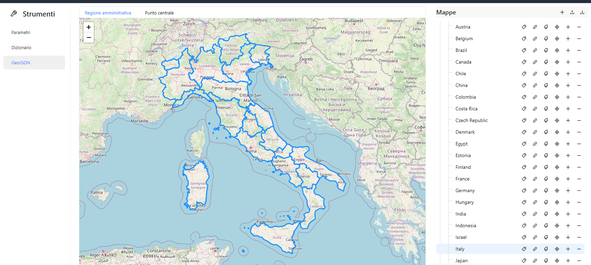
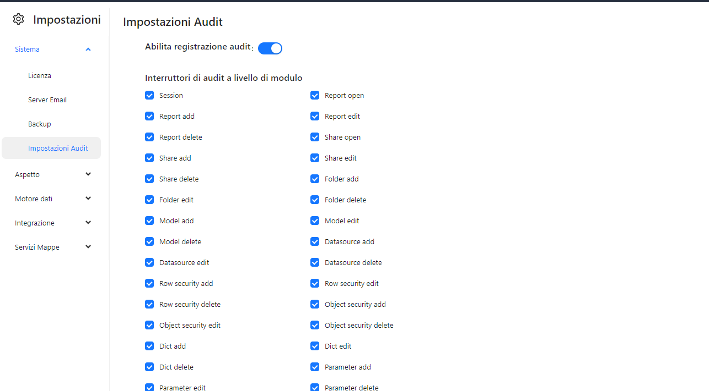
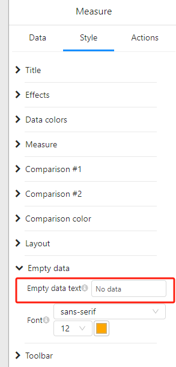

# Version 7.05 Updates

## New Features:

1. All charts now support independent subscription settings.

   

2. Lineage tracking is available for reports, models, and data sources.

   **Note: **

   **a) Previously developed reports need to be re-saved before their lineage can be viewed.**

   **b) The Modeler plugin version 4.03 needs to be installed.**

   

3. Custom GeoJSON maps can be used in both the **Filled GeoJSON Map** and **Marker GeoJSON Map** components.

   **Add the following code to the `ImportHandlerMimeTypeDefinitions` file, then restart PBA to initialize the map:**

   

   

4. Log auditing capabilities have been added.

   

5. The **Measure** component now includes a configurable “No data” display option.

   

6. New data source types added

   Azure SQL，Azure Synapse

7. Supports Italian and Spanish languages.

## Bug Fixes:

1. vis-28 [HIERARCHY FILTER ISSUE](https://datafor.atlassian.net/jira/servicedesk/projects/VIS/queues/custom/20/VIS-28)
2. vis-29 [URGENT: Using the Measure Chart object in some cases there are problems in displaying the data](https://datafor.atlassian.net/jira/servicedesk/projects/VIS/queues/custom/20/VIS-29)

## Performance：

1. When performing queries and applying an `ORDER BY` clause on any selected dimension column, it is no longer necessary to explicitly specify `NULLS FIRST` or `NULLS LAST`. The default sorting behavior for NULL values provided by the database can be used instead.